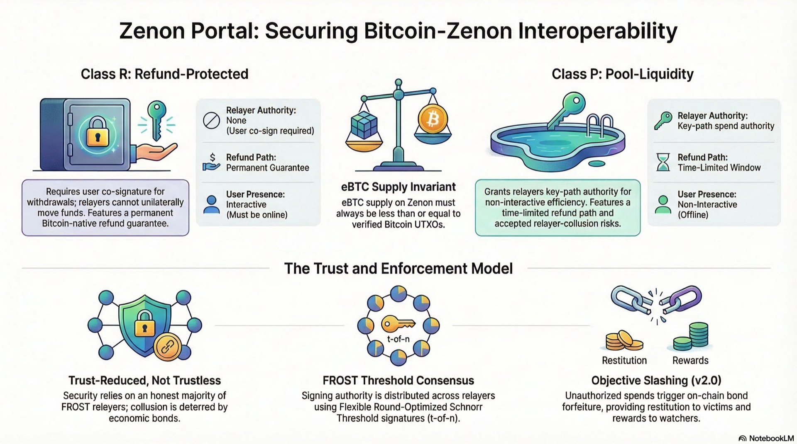

# Zenon Portal v1.5 — Bitcoin Interoperability Blueprint

[](https://ebtc.wtf)

**Live site: [ebtc.wtf](https://ebtc.wtf)**

## What is this?

A visual explainer for **Zenon Portal v1.5**, a trust-reduced interoperability protocol that connects Bitcoin and Zenon Network. The site presents the full technical blueprint as a scrollable, slide-based document.

## Protocol Summary

Zenon Portal treats Bitcoin as a **custody and settlement layer** and Zenon Network as an **execution layer**. BTC never leaves the Bitcoin base layer — it remains locked in Taproot escrow UTXOs on Bitcoin while Zenon maintains a verifiable receipt ledger. The two chains are connected through cryptographic proof rather than trusted attestation.

### How it works

1. **Deposit** — A user locks BTC into a Taproot escrow script on Bitcoin.
2. **Verify** — A relayer submits an SPV Merkle inclusion proof to Zenon, cryptographically proving the deposit exists on Bitcoin.
3. **Mint** — Zenon credits **eBTC** to the depositor — a Zenon-native accounting receipt representing a verified claim on a base-layer Bitcoin UTXO.
4. **Withdraw** — The user burns eBTC on Zenon, and a FROST threshold signature (t-of-n Schnorr) unlocks the original BTC on Bitcoin.

### Two escrow classes

Depositors explicitly choose between two escrow models at deposit time:

| | **Class R** (Refund-Protected) | **Class P** (Pool-Liquidity) |
|---|---|---|
| **Design goal** | Strict user safety | Execution efficiency |
| **Key-path authority** | Disabled (NUMS point) — relayers have zero unilateral power | FROST Epoch Key — relayers can spend via key-path |
| **Withdrawal UX** | Interactive — requires depositor's live signature (`pk_u`) | Non-interactive — relayer-managed |
| **Relayer theft risk** | Impossible (requires user co-signature) | Requires threshold collusion |
| **UTXO consolidation** | Impossible without user cooperation | Allowed after Safety Window (2016 blocks) |
| **Unilateral refund** | Permanent guarantee (if UTXO unspent and `pk_u` retained) | Time-limited (eliminated after consolidation) |

### System architecture

```
┌────────────────────────────────────────────────┐
│                  USER LAYER                     │
│  Deposits BTC · Burns eBTC · Constructs refunds │
└──────────────────┬─────────────────────────────┘
                   │
        ┌──────────┴──────────┐
        │                     │
┌───────▼────────┐  ┌────────▼──────────────────┐
│ BITCOIN LAYER  │  │      ZENON LAYER          │
│                │  │                           │
│ Taproot UTXOs  │  │ SPV verifier + headers    │
│ Escrow scripts │◄─┤ eBTC state contract       │
│ Timelock paths │  │ Withdrawal burn events    │
│ Withdrawal txs │  │ Relayer registry + epochs │
└───────┬────────┘  └────────┬──────────────────┘
        │        ┌───────────┘
        │        │
┌───────▼────────▼───────────────────────────────┐
│               PORTAL LAYER                      │
│  Relayer nodes · FROST signing · SPV proofs     │
│  Bitcoin tx construction + broadcast            │
└─────────────────────────────────────────────────┘
```

### Cryptographic foundations

- **Taproot (BIP 340–342)** — Escrow scripts use P2TR outputs with carefully constructed taptrees. Class R disables the key-path via a NUMS (Nothing-Up-My-Sleeve) point; Class P places the FROST epoch key at the internal key.
- **FROST threshold signatures** — Flexible Round-Optimized Schnorr Threshold Signatures enable any `t` of `n` relayers to produce a single aggregate Schnorr signature. Unlike MuSig2 (n-of-n), FROST tolerates relayer unavailability and leaves no on-chain evidence of which relayers signed.
- **SPV verification** — Zenon maintains a continuous chain of Bitcoin block headers anchored to a governance-approved genesis checkpoint. Deposit proofs are Merkle inclusion proofs validated against this header chain, with resistance to CVE-2012-2459.

### Trust model

Zenon Portal is **trust-reduced, not trustless**. The dominant trust assumption is that fewer than the FROST threshold `t` of epoch relayers collude. For Class R deposits, relayer misbehavior can only cause withdrawal *delay* — the Bitcoin-native refund path guarantees fund safety. For Class P deposits, a colluding relayer majority could redirect funds; economic deterrence via attributable slashing (bond forfeiture) mitigates but does not eliminate this risk.

The protocol sits between federated multisig bridges (high trust, opaque custody) and a fully trustless two-way peg (currently impossible on the Bitcoin base layer without consensus changes).

### eBTC supply invariant

```
Total eBTC supply ≤ total value of verified escrow UTXOs
```

eBTC is fully fungible at the protocol accounting level, but collateral quality varies: Class R UTXOs are shielded from relayer action while Class P UTXOs are liquid. Secondary holders who acquire eBTC on the open market do not control the underlying `pk_u` and have no Bitcoin-native refund path — their exit depends entirely on Zenon network liveness and pool collateralization.

## What the site covers

1. The UTXO → eBTC air-gap architecture
2. Settlement layer vs execution layer separation
3. The deposit → verify → mint → withdraw lifecycle
4. Class R and Class P escrow script trees (Taproot)
5. Security trade-off matrix
6. SPV verification and the genesis checkpoint
7. Relayer system and FROST coordination
8. UTXO consolidation and safety windows
9. Cross-layer withdrawal protocol
10. Economic security via attributable slashing
11. Unilateral refund paths
12. eBTC fungibility and secondary holder risks
13. Where Zenon Portal sits on the trust spectrum

## Full specification

The complete protocol specification is available at **[Zenon Portal Spec](https://github.com/TminusZ/zenon-developer-commons/blob/main/docs/specs/Zenon%20Portal/Zenon%20Portal%20Spec.md)** in the zenon-developer-commons repository.

The spec covers cryptographic primitives, Bitcoin SPV verification, deposit escrow script design, the eBTC state model, withdrawal protocol, relayer system (including FROST epoch key management and attributable slashing), refund paths, UTXO consolidation, a full security model with enumerated trust assumptions, economic incentives, scalability analysis, failure modes, and normative test vectors.
